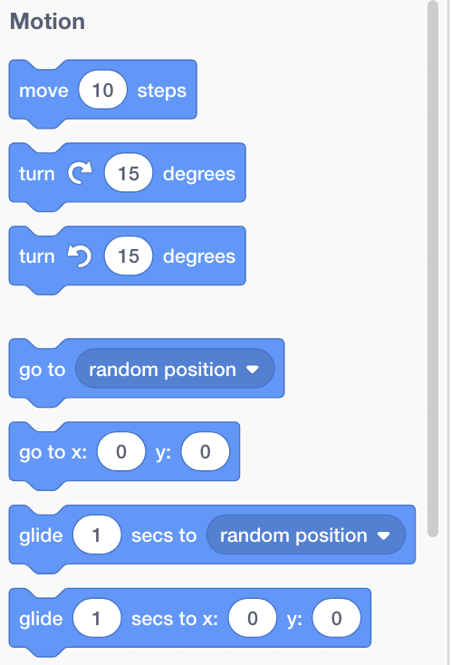

## Adding & removing code

Great! You’ve written your first Scratch program. Time to learn a little more about gettng code in and out of Scratch! Scratch code is made up of **blocks** that you snap together to make programs. 

![])(images/code1.png)

These blocks come from the **Code Blocks Pallet** where they are broken up into different categories. 

+ By clicking on the category names, you can see the blocks in that category. Here, the **motion** category is selected. 

+ All of the blocks in the selected category are shown in a list. You can pick the one you want, click on it and hold down the mouse button, then just drag it onto the **current sprite panel** and let go. 

+ Once the block is in the **current sprite pane** you can move it around and snap it to other blocks. If you want to see what a block does, you can double-click on it and it will run!

Normally, you want your blocks to run automatically, when something happens. This is why most of your programs will start with a block from the **events** category. Most often, it will be this one: 

The code blocks connected to this block will run after the **green flag** is clicked

Code blocks run from top to bottom, so the order you snap your code together in matters. In this example, the sprite will `say` `Hello!` before it will `play` the `meow` sound. 

+ Removing, or deleting, code blocks you don’t want in your program is easy! You just have to click on the **scissors** icon and then click on the code you want to remove. 

Be careful though! **You will delete all the blocks connected to the one you click on**. If you do this by accident and want to get your code back, you can use the `**edit**` menu and click on `**undelete**`. 

+ Try adding, deleting, and undeleting some code blocks now! 

Now you know how to move code around and make things happen, time to try a simple program: Making the Scratch Cat walk in a circle!

+ Make sure you have the cat selected in the sprite list and then drag these blocks together. You’ll find them in **events** and **motion**. 

+ Then, click on the green flag above the **stage**. If you click too many times and the cat walks away, you can drag it back! 

That’s a cat walking in a straight line... not exactly what you want. 

+ Snap this block to the end to make it walk in a circle. It’s in **motion** too. 

This block makes the cat turn 15 degrees of the full 360 degrees that make up a circle. You can change that number, and the number of steps, by clicking on the number and typing a new value.

+ Now save your work! You do this by going to the `**file**` menu and clicking `**save**`. 

+ Remember to save regularly as you work!

+ You can also use `**save as**` to save a copy of your program with a new name.
