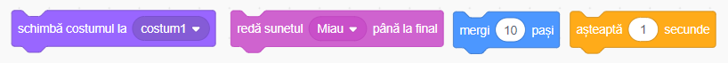
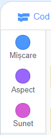
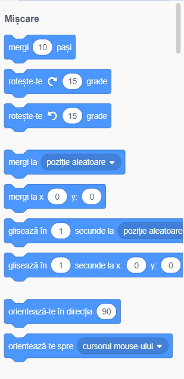
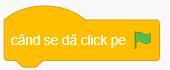
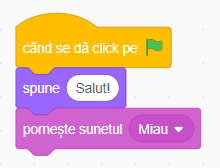
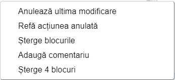
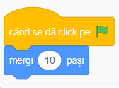
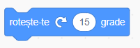

## Adăugarea și ștergerea blocurilor de cod

Perfect! Ai scris primul tău program în Scratch! E timpul să înveți mai multe despre cum să adaugi și să ștergi cod în Scratch. Codul este făcut din **blocuri** ca astea:

O să găsești toate blocurile în **meniul de blocuri de cod**, sortate în diferite categorii în funcție de ce fac.

---
####  Folosirea blocurilor din mai multe categorii

Apasă pe o categorie pentru a vedea blocurile din acea categorie. Aici, categoria **Mișcare** este selectată:

Toate blocurile din categoria pe care ai apăsat apar într-o listă:

Apasă pe blocul pe care îl vrei și trage-l în panoul personajului curent. Odată ce e acolo, îl poți aranja și conecta cu alte blocuri.

---

Dacă vrei să vezi ce face un bloc poți să dai dublu-click pe el pentru a-l face sa ruleze!

+ Încearcă să dai dublu-click pe câteva blocuri și vezi ce fac.

---
####  Rularea codului

De obicei codul tău ruleaza automat odată ce un anume lucru se întâmplă. De aceea multe dintre programele tale or să înceapă cu un bloc din categoria **Evenimente**, adesea acesta:

Astfel, blocurile de cod conectate la acest bloc vor rula după ce **steagul verde** este apăsat.

Blocurile de cod rulează de sus în jos, așa că **ordinea** în care sunt puse **contează**. În acest exemplu, personajul va `zice`{:class="block3looks"} `Salut!` inainte să `pronunțe`{:class="block3sound"} sunetul `miau`.

---

Ștergerea blocurilor de cod din program este ușoară! Trebuie doar să le tragi înapoi în meniu.

**Ai grijă:** dacă ștergi un bloc, o să ștergi și toate blocurile conectate prin el. Asigura-te că le separi pe cele pe care vrei să le păstrezi. Dacă ai șters din greșeala niște blocuri și le vrei înapoi, dă click-dreaptă și selectează **Anulează ultima modificare**. 

+ Acum poți încearca să adaugi, ștergi, și să dai **anulează** la câteva blocuri de cod.

### Pune totul laolaltă

Acum știi cum să manevrezi codul și să faci lucruri să se întâmple, este timpul ca tu să faci Pisica să meargă în cercuri!

+ Asigură-te că ai personajul Pisică selectat, după care trage aceste blocuri și conectează-le. O să le găsești în listele de **Evenimente** și de **Mișcare**.

+ Apoi apasă pe steagul verde de deasupra Scenei. 

Ar trebui să vezi Pisica mergând în linie dreaptă... nu chiar ce ai vrut, nu?

Dacă apeși de prea multe ori pe steag și Pisica o ia la fugă poți să o tragi înapoi!

+ Adaugă acest bloc la sfârșit ca să faci Pisica să meargă în cercuri. Este tot în lista de **Mișcare**.

---
####  Cum funcționează răsucirea?

Acest bloc face personajul să se răsucească 15 grade din cele 360 care formează un cerc. Poţi schimba acest număr, dacă apeși pe el și scrii o nouă valoare. 

---

+ Acum salvează ce ai făcut și hai să mergem mai departe!
