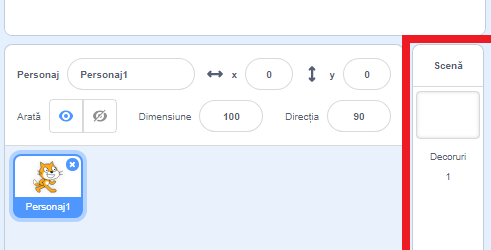
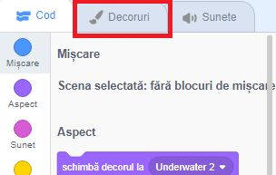
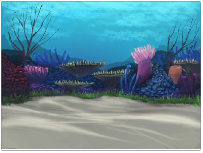
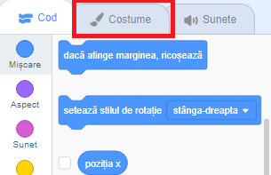
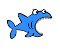
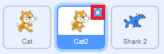

## Stabilirea decorului

Hai sa alegem decorul!

+ Selectează Scena.

+ Click pe tabul **Decoruri**.

+ Click pe butonul **Alege un decor**.

 
+ Acum alege-ți decorul subacvatic preferat! 

Excelent! Acum ai o pisică sub apă, dar știm că pisicilor nu le place apa. Putem schimba asta, transformând pisica în rechin.

+ Prima dată selectează pisica din personaje, iar apoi selectează tabul **Costume**.

+ Apoi, click pe butonul **Alege un costum**

+ Selectează rechinul din această imagine. 

+ Acum șterge costumele pisicilor: selectează fiecare costum și apoi apasă butonul **x**.

Excelent, acum ai un rechin!
