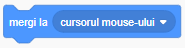

## Controlarea mișcării personajului

Acum hai să facem rechinul să înoate în ce direcție vrem noi.

Pentru început, selectează personajul și sterge toate blocurile de sub `Cănd se dâ click pe`!

+ Acum caută blocul de mai jos din categoria **Mișcare** și adaugă-l în zona de cod a personajului curent:

+ Apasă pe săgeata de lângă `poziție aleatoare`. Iți va apărea încă o opțiune - `cursorul mouse-ului`. Vom selecta opțiunea asta pentru că vrem ca rechinul să urmarească apăsarea pe ecran.

Dacă apăsăm pe stegulețul verde vedem că rechinul vine după noi prima dată, dar rămâne acolo. Scopul nostru e să se mute de fiecare data acolo unde apăsam pe ecran.

Pentru asta vom avea nevoie de un bloc nou, de tip **control**, să se mute mereu unde este cursorul mouse-ului, nu doar la inceput. Hai să adăugăm blocul `la infinit` și să-l modificăm astfel:

---
####  Ce face noul bloc?

Blocurile de **Control** fac acţiuni în mod repetat de un anumit număr de ori, sau cât timp se respectă anumite condiţii.

Aici, rechinul face orice este înăuntrul blocului `la nesfarșit`{:class="block3control"} întruna, fara să se oprească. Deci odată ce a făcut ultima acţiune din blocul `la nesfarșit`{:class="block3control"}, o ia de la capăt și reface toate acţiunile, iar și iar.

---

+ Apasă pe stegulețul verde să vedem ce am făcut.

Rechinul se mută acolo unde apasăm, nu?
