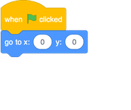

## Controlarea miscarii personajului

Acum, rechinul tău se mișcă în cerc, dar ar fi mult mai distractiv să-l putem controla. În acest card o să învațăm cum să facem asta!

+ Începe prin a ștege tot condul asociat rechinului.

Vom avea nevoie în plus fata de **Evenimente** șî **Mișcare** si de blocul **control**.

+ Pentru început caută blocul de mai jos si adaugă-l în zona de cod a personajului curent:

+ Apasă pe sageata de lângă `poziție aleatoare`. Iți va apărea încă o opțîune, `cursorul mouse-ului`. Vom selecta opțiunea asta pentru că vrem ca rechinul să urmarească apăsarea pe ecran.

Acum avem nevoie de `cand se da click pe stegulet` si să conectam blocul **mergi la** cu acesta. Dacă apăsăm pe stegulețul verde vedem că rechinul vine după noi, dar rămâne acolo. Ne-ar trebui ceva care să caute mereu pozitia cursorului. Caută blocul de mai jos si conectează-l de `cand se da click pe`

+ Apasă pe stegulețul verde sa vedem ce am făcut.

Rechinul se muta acolo unde apasăm, nu?

--- collapse ---
---
title: How do x- and y-coordinates work?
---

To talk about the positions of objects, such as sprites, we often use x- and y-coordinates. The **x-axis** of the Stage coordinate system runs from **left to right**, and the **y-axis** runs from **bottom to top**. 

A sprite can be located by the coordinates of its centre, for example `(15, -27)`, where `15` is its position along the x-axis , and `-27` its position along the y-axis.

+ To get a feel for how this actually works, select a sprite and use the **x** and **y** controls to move it around the stage by setting different values for the coordinates.

+ Try different pairs of values to see where the sprite goes! In Scratch, the x-axis goes from `-240` to `240`, and the y-axis goes from `-180` to `180`.

--- /collapse ---

### Restarting the game

The shark moves all over the screen now, but imagine this is a game: how do you restart it, and what happens at the start of each game?

You need to get the shark to its original location when the player starts the game. They'll start this game by clicking on the green flag, so you need to change the shark sprite's x- and y-coordinates when that happens.

That’s actually pretty easy! The centre of the stage is `(0, 0)` in `(x, y)` coordinates. 

So all you need is an **Event** block for that green flag, and the **go to** block from **Motion**. 

+ Drag a `when green flag clicked`{:class="block3events"} **Event** block onto the current sprite panel.

+ Then find the `go to`{:class="block3motion"} **Motion** block, and attach it to your flag **Event** block.

+ Set the both the `x` and the `y` coordinate to `0` in the `go to`{:class="block3motion"} block if they are not already `0`. 

+ Now click the green flag: you should see the shark return to the centre of the stage!
