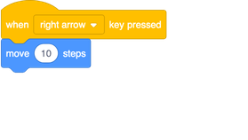
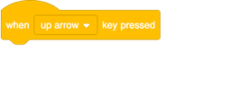
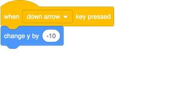

## Învățăm să mișcăm personaje

Să învățăm cum să mișcăm rechinul folosind tastele!

+ Hai să căutăm blocul de mai jos și sa îl tragem in zona de cod:

+ Dă click pe săgeata mica (▼) de lângă cuvântul `spațiu`. O să vezi o lista cu toate tastele pe care le poți alege.

Vei avea nevoie de 4 blocuri `when key pressed`{:class="block3events"} - câte una pentru fiecare săgeată. Pentru a face rechinul tău să se miște, va fi nevoie sa conectezi blocurile astfel:

**Notă**: `-10` înseamnă 'mergi înapoi 10 pași'.

+ Add the blocks shown above to your program, and click the green flag to test out your code.

Now your shark moves back and forwards, which is pretty cool, but it doesn’t move up or down. Also, if you look through the **Motion** blocks, you’ll see there are no blocks for 'up' or 'down'. There are a whole bunch of them related to **x** and **y** coordinates though — let's try those!

+ Grab two `change y by`{:class="block3motion"} blocks, and update your code like this: 

Now when you press the arrows keys, the shark moves all over the stage!

--- collapse ---
---
title: How do x- and y-coordinates work?
---

To talk about the positions of objects, such as sprites, we often use x- and y-coordinates. The **x-axis** of the Stage coordinate system runs from **left to right**, and the **y-axis** runs from **bottom to top**. 

A sprite can be located by the coordinates of its centre, for example `(15, -27)`, where `15` is its position along the x-axis , and `-27` its position along the y-axis.

+ To get a feel for how this actually works, select a sprite and use the **x** and **y** controls to move it around the stage by setting different values for the coordinates.

+ Try different pairs of values to see where the sprite goes! In Scratch, the x-axis goes from `-240` to `240`, and the y-axis goes from `-180` to `180`.

--- /collapse ---

### Restarting the game

The shark moves all over the screen now, but imagine this is a game: how do you restart it, and what happens at the start of each game?

You need to get the shark to its original location when the player starts the game. They'll start this game by clicking on the green flag, so you need to change the shark sprite's x- and y-coordinates when that happens.

That’s actually pretty easy! The centre of the stage is `(0, 0)` in `(x, y)` coordinates. 

So all you need is an **Event** block for that green flag, and the **go to** block from **Motion**. 

+ Drag a `when green flag clicked`{:class="block3events"} **Event** block onto the current sprite panel.

+ Then find the `go to`{:class="block3motion"} **Motion** block, and attach it to your flag **Event** block.

+ Set the both the `x` and the `y` coordinate to `0` in the `go to`{:class="block3motion"} block if they are not already `0`. 

+ Now click the green flag: you should see the shark return to the centre of the stage!
