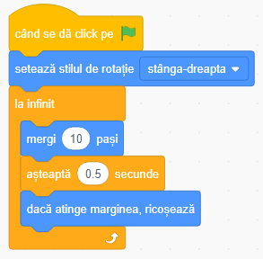

## Toate personajele

Acum avem un rechin care se mută încotro ne dorim noi. Bravo! Este timpul să-i dăm rechinului de mâncare - hai să adăugăm un pește de prins!

+ Click pe butonul **Alege un personaj**, iar din fereastra care s-a deschis, alege peștele.

Dacă peștele este prea mare, poți modifica dimensiunea acestuia pentru a fi potrivit pentru rechin:

+ Click pe **Dimensiune** și modifică valoarea afișată pentru a-l face mai mic sau mai mare.

Bravo! Mai târziu vom adauga cod pentru a-l face pe peștișor sâ se mute pe cont propriu fară ajutorul jucătorului. Treaba jucătorului va fi să încerce să mute rechinul pentru a prinde peștele.

--- collapse ---
---
title: Rechinul inoată cu spatele?
---

Pare puțin amuzant ca un rechin să inoate cu spatele. Exact cum și tu te întorci cu fața în loc să mergi cu spatele, așa șî rechinul ar trebui să se întoarcă în loc să înoate cu spatele. Bineînțeles, Scratch are un bloc pentru asta!

Blocul `orientează-te în direcția`{:class="block3motion"} iți permite să alegi direcția personajului. Il vei găsi în blocurile de tip **Mișcare**. 
Poți introduce oricâte grade dorești pentru a orienta personajul în orice direcție dorești.
--- /collapse ---

+ Adaugă câteva blocuri `orientează-te în direcția`{:class="block3motion"} din categoria **Mișcare** si conectează-le la codul rechinului, astfel: 

+ Change the number of steps in the `move`{:class="block3motion"} blocks from `-10` to `10`.

Dacă încerci să muți rechinul acum, după ce ai adaugat blocurile `orientează-te în direcția`, o să observi că se întâmplă ceva ciudat. Rechinul nu se intoarce tocmai corect!

--- collapse ---
---
title: De ce ajunge cu capul în jos?
---

Problema aici este că rechinul începe, ca orice alt personaj, cu **stilul de rotație** 'de jur imprejur', iar ce avem noi nevoie este 'stânga-dreapta'.

Ca de obicei, există un bloc pentru asta în categoria **Mișcare**. 

--- /collapse ---

+ Caută in categoria **Mișcare** blocul `setează stilul de rotație`{:class="block3motion"}.

+ Adaugă blocul în codul resetat de mai devreme și seteaza stilul rotației in `stânga-dreapta` astfel: 

