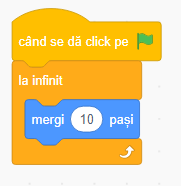
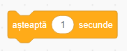
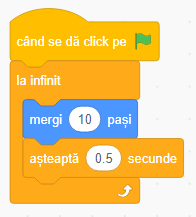
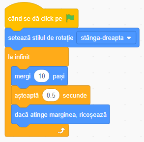
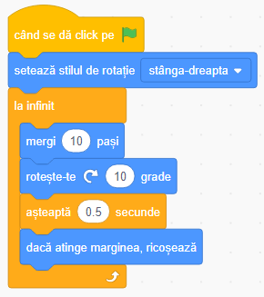
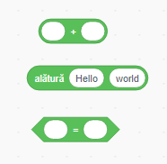
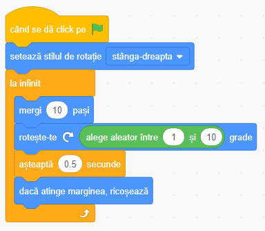

## Pește controlat de calculator
Ok, acum hai să facem peștele să înoate de unul singur.

+ Pentru început selectează personajul Pește!

+ Trage un **Eveniment** `când se dă click pe steagul verde`{:class="block3events"}, un **Control** `la infinit`{:class="block3control"}, și o **Mișcare** `mergi 10 pași`{:class="block3motion"} în **panoul personajului**, așa: 

+ Acum apasă pe steagul verde și urmărește ce se întâmplă!

Ei bine, primul tău pește s-a lovit de marginea Scenei și se mișcă prea repede pentru ca un Rechin să îl poată prinde.

Pentru început, trebuie să încetinești peștele. Asta e destul de ușor, trebuie doar să îl pui să aștepte puţin după fiecare 10 pași făcuţi.

+ Adaugă blocul `așteaptă`{:class="block3control"} în codul tău înăuntru blocului `la infinit`{:class="block3control"}, și schimbă numărul în `0.5` astfel:

---
####  Ajustări

Numărul pe care l-ai setat la `așteptare`{:class="block3control"} zice câte **secunde** vrei să aștepte peștele. `0.5` este jumătate de secundă.

Poţi încerca cu mai multe valori șă vezi care se potrivește mai bine pentru jocul tău. Reţine ca poţi schimba și numărul de pași din blocul `mergi`{:class="block3motion"}!
---

Peștele se mișcă acum, dar noi vrem să se și întoarcă atunci când atinge marginea Scenei. Ce noroc că avem un bloc de **Mișcare** pentru asta!

+ Găsește blocul `dacă atingi marginea întoarce-te`{:class="block3motion"} și adăuga-l după blocul `așteaptă`{:class="block3control"}.

---
####  Ce face noul bloc?

Blocul `dacă atingi marginea întoarce-te`{:class="block3motion"}, verifică dacă personajul atinge merginea Scenei și, dacă atinge, se întoarce în direcţia opusă.

---
####  De ce ajunge cu capul în jos?

Problema aici este că peștele începe, ca orice alt personaj, cu **stilul de rotație** 'de jur imprejur', iar ce avem noi nevoie este 'stânga-dreapta'.

Ca de obicei, există un bloc pentru asta în categoria **Mișcare**. 

---

+ Caută in categoria **Mișcare** blocul `setează stilul de rotație`{:class="block3motion"}.

+ Adaugă blocul în codul resetat de mai devreme și seteaza stilul rotației in `stânga-dreapta` astfel: 

Peștele se mișcă în faţă și în spate acum, dar numai în linie dreaptă — un pic prea ușor pentru jucătorul cu Rechinul! Trebuie să faci peștele mai imprevizibil.

Știi deja din pașii anteriori cum să faci un personaj să se răsucească, poți începe de acolo.

+ Adaugă o răsucire în mișcarea peștelui, după care apasă steagul verde.

E mai bine, dar încă este prea multă predictibilitate în mișcările peștelui. Trebuie să fie mai întâmplătoare. Din fericire, Scratch poate să ia decizii întâmplătoare pentru tine! Pentru asta o să ai nevoie de un nou bloc, de **Operaţie**.

---
####  Ce este o operaţie?

**Operaţile** primesc una sau mai multe valori (de exemplu numere, text, `Adevărat/Fals`) și dau înapoi o singură valoare. Vei știi ce fel de valoare vor rezulta din forma blocului: cele rotunjite rezultă număr sau text, iar cele ascuţite `Adevărat/Fals`.

---

+ Gasește **operaţia** `alege la întâmplăre`{:class="block3operators"} , și trage-o în campul unde setezi numărul de grade din blocul de **Mișcare** `grade de rotaţie`{:class="block3motion"}.

**Nota**: poţi schimbă minimul și maximul din care să se aleagă la întâmplăre, dar cele de bază(`1` și `10`) sunt destul de bune pentru acest joc, așa că le poţi lăsa neschimbate.

+ Acum apasă steagul verde și urmărește ce se întâmplă!

--- 
####  Deci ce face acum blocul de "la nesfarșit"?

Blocul de "la nesfarșit" face personajul pește să faca 4 lucruri în ordine:
1. Să meargă înainte
1. Să se rotească umpic
1. Să aștepte
1. Să verifice dacă e la marginea Scenei  

Când personajul termină de făcut verificarea, o să înceapă de la capătul buclei și o să meargă, rotească, aștepte, verifice din nou și din nou pana când o să oprești programul Scratch.
 
 ---
 
Cool! Urmează: să prinzi peștele!

