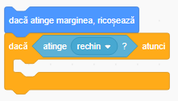
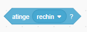
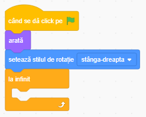
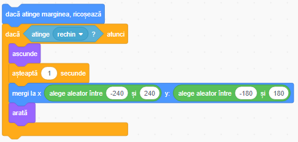

## Pescuirea!

Rechinul se muta, peștele înoată, dar ei nu interacționează. Dacă peștele înoată chiar in gura peștelui nu se întamplă nimic. E timpul să schimbăm asta!

Mai întâi trebuie sa aflăm dacă peștele atinge rechinul. Pentru asta avem nevoie de blocuri de tipurile **Control** si **Detectare**.

+ Adauga în secțîunea de cod a peștelui, blocul `daca...atunci`{:class="block3control"} de tipul **Control**, in interiorul blocului `la infinit`{:class="block3control"}, imeadiat după blocul `dacă atinge marginea`.

+ Adaugă blocul de decizie `atinge...` în spatiul liber din blocul `dacă...atunci` și apasă pe triunghi pentru a selecta rechinul. Dacă nu i-ai schimbat numele va fi 'Sprite1'.

--- collapse ---
---
title: Cum funcțîonează?
---

Blocul `dacă...atunci`{:class="block3control"} de tipul **Control** are nevoie de o valoare `Adevarat/Fals` și execută codul doar pentru `Adevarat`. 

Blocurile de tipul **Detectare** colecteaza informatii, de exemplu un e personajul sau ce atinge, etc. Vom folosi acest block:

Judecând după forma acestuia, putem trage concluzia că ne va oferi acea valoare `Adevarat/Fals` de care blocul `dacă...atunci` are nevoie.

--- /collapse ---

Bineinteles, ai adăugat un block `dacă...atunci`{:class="block3control"}, dar nu ai adăugat nimic pentru zona 'atunci'. În momentul ăsta codul tau verifică peștele atinge rechinul, dar nu reacționează in niciun fel.

Poți face ca pestele să dispară, ca și cum rechinul l-ar mânca, folosing blocul `ascunde`{:class="block3looks"}. 

+ Gasește blocul `ascunde`{:class="block3looks"} in categoria **Aspect** si adaugă-l în interiorul blocului `dacă...atunci`{:class="block3control"} astfel: 

Acum în momentul când rechinul prinde peștele, acesta dispare definitiv. Asta nu e bine.

+ Adaugă blocul `arată`{:class="block3looks"} **Aspect** din categoria **Looks** la începutul codului peștelui pentru a putea reseta jocul.

Asta este deja mai bine, dar nu cred că vream ca jucătorul să restarteze jocul de fiecare dată când prinde un pește.

+ Modifică codul din interiorul blocului `dacă...atunci`{:class="block3control"} să arate ca:

--- collapse ---
---
title: How does this work?
---

Foarte bine: când pestele se ascunde, asteaptă câteva momente, se mută, iar apoi reapare. 

Pare care un nou pește apare de fiecare dată, dar defapt este un singur personaj care se muta.

--- /collapse ---

Avem un joc! Dar nu avem deocamdată niciun mod pentru a ține scorul ori pentru câștigarea jocului. Poți repara asta in cardul următor.
