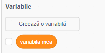
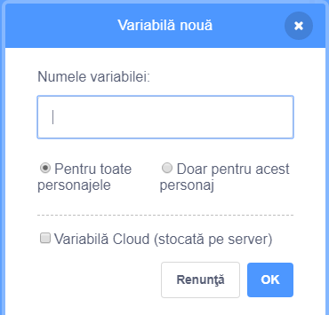
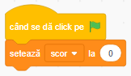
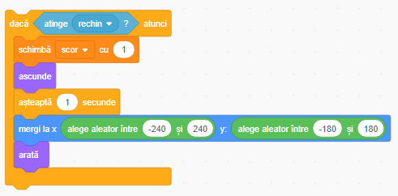

## Salvarea scorului

Pentru a reține numărul peștișorilor prinși de jucător vei avea nevoie de un loc în care să păstrezi scorul, o modalitate de a aduna, și o modalitate de a-l reseta atunci când începi un joc nou.

+ Prima dată: să salvăm scorul! Mergi la categoria de blocuri de cod **Variabile** și selectează **Creează o Variabilă**.

+ Setează-i numele `scor`. 

Verifică noua variabilă!

---
####  Ce sunt variabilele?

Când vrei să păstrezi informații într-un program, poți folosi ceva numit **variabilă**. Gândește-te la ea ca la o cutie cu o etichetă pe ea: poți pune ceva in ea, poți verifica ce conține și îi poți modifica conținutul. Variabilele se găsesc în secțiunea **Variabile**, dar ele trebuie create mai întâi pentru a fi afișate aici!

---

Acum trebuie să modifici variabila de fiecare dată când rechinul mănâncă un pește și să îl resetezi atunci cand jocul este repornit. Ambele lucruri sunt destul de simple:

+ Din secțiunea **Variabile**, alege blocurile `setează [variabila mea] la [0]`{:class="block3variables"} și `schimbă [variabila mea] cu [1]`{:class="block3variables"}. Selectează micile săgețele din interiorul blocurilor, alege `scor` din listă, și apoi așază blocurile în programul tău:

### Codul pentru rechin

### Codul pentru pește

Grozav! Acum ai și scor!

---

## Provocare: câștigarea jocului

+ Alege un scor la care jucătorul caștigă, și fă să se întâmple ceva tare atunci când jucătorul câștigă. Rechinul ar putea să felicite jucătorul sau ai putea afișa un mesaj "Ai câștigat!" sau ar putea începe să cânte o melodie sau... ai înțeles ideea!

---
